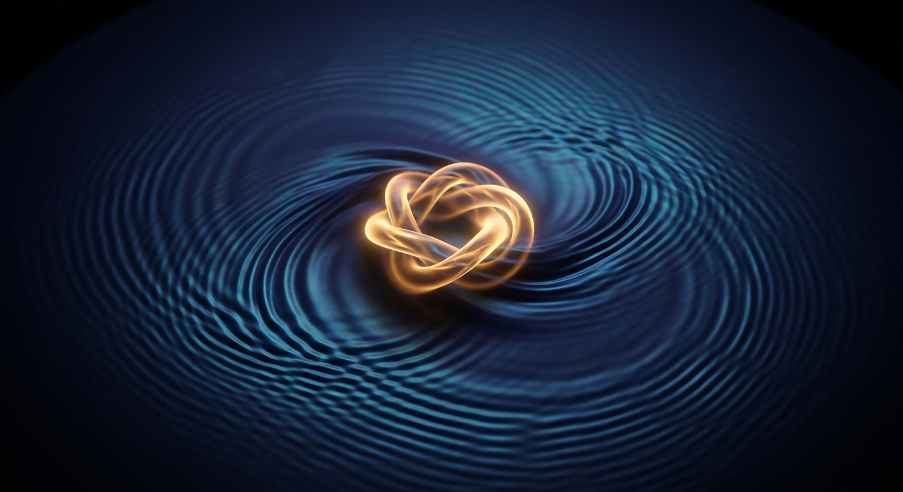
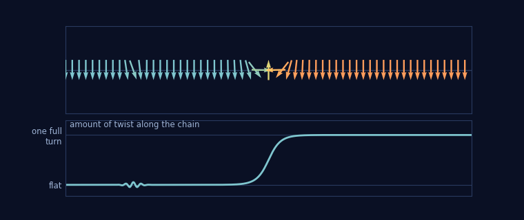
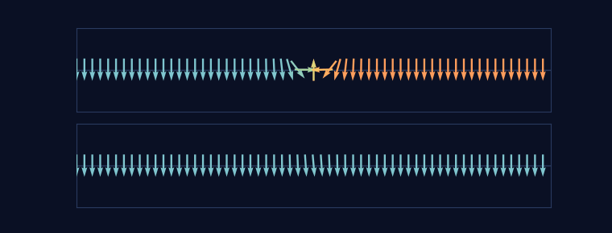
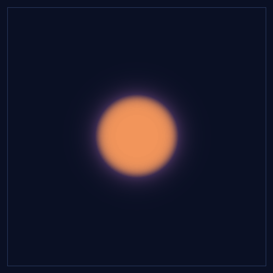
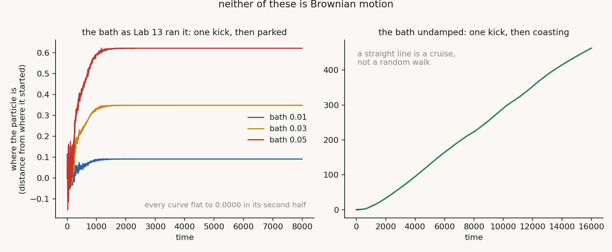
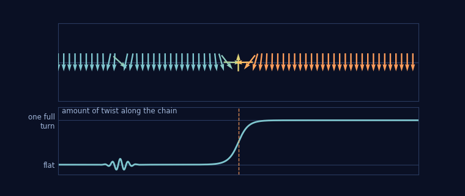

# The Lattice That Was Too Perfect

*Quest for Entropy #7: I played with lattices — thousands of coupled pendulums — to see if they could build real waves and a real particle on their own. This is how far they went, and where they stopped.*

## The question

Last episode ended with a shopping list.

I wanted a closed deterministic machine that makes its own wave — no boundary drawn by hand, no metronome, no motor under the dish — and whose motion looks random from the inside, with no dice hidden anywhere. The walking droplets had named the missing ingredient: something that writes a record, and then gets steered by what it wrote.

A single swinging object cannot do that — there is nowhere to write. So: many of them, coupled. A lattice. A disturbance can travel elsewhere and come back changed; the medium itself becomes the notebook.

And the jostle? My plan for that was chaos: a lattice tangled enough to shake its own particle, the way #4's billiards shook everything. But chaos in a lattice needs room — it lives in the higher-dimensional configurations — and my compute could honestly measure only the simplest ones. So the road started small: a chain, and a sheet, to test the assumptions first.

Before running anything, the exam. For this road to create a particle, the lattice must:

1. **Make real waves.** No wave equation assumed — ripples have to come out of the twisting and dragging, or not at all.
2. **Make a particle.** Something localized that holds itself together, with no help from outside.
3. **Keep a two-way conversation.** The droplet's lesson: the particle writes into the medium; the medium steers it back.
4. **Make its own apparent randomness.** The medium's own motion should jostle the particle — random-looking outside, deterministic underneath.

This is the story of that lattice. It passes the first two demands with honours — genuine waves and a genuine particle from neighbours pulling on neighbours, the furthest any of my classical machines ever got. Demands three and four failed here, each with a number attached — and the reason they failed turned out to be the discovery of the episode: the chain I could afford to measure has no chaos in it at all. Not a little. None.

## The medium

I took the pendulum from last episode and made thousands of them.

They hang on one long wire, each tied to its neighbours with a bit of springiness: when one pendulum twists, it drags its neighbours after it. That is the whole machine — each point an angle, each angle pulling on the angles next door, gravity pulling every angle back down. Physicists call the equation sine-Gordon, one of the most-studied nonlinear wave equations there is. Our chain is two thousand of them.

How many dimensions should the medium have? We climbed the ladder.

**One dimension — a chain.** This is where the numbers in this article come from: cheap to run, exact to measure.

**Two dimensions — a sheet.** The same idea with four neighbours instead of two, and this is where the waves get beautiful. I struck a sheet of pendulums in two places and watched:

Every point in that picture is one pendulum, feeling only its four neighbours and its own gravity. Nobody told this system about waves — and out come circular ripples that spread, interfere where they overlap, and pass through each other unharmed. Real waves, from local pulling alone. Demand one: passed.

**Three dimensions — and up.** The zoo gets richer and harder; its residents come in a moment. I measured in one and two dimensions, where every number can be checked exactly — the 3D runs we could only watch, and this diary tries to count only what it can measure.

## The inhabitants

So who actually lives in this medium? A small zoo, it turns out — and what can exist depends on how many dimensions it has to live in.

**The ripple — lives everywhere (1D, 2D, 3D).** Pure *motion*: it spreads, fades, and passes through everything, including every other beast here. The medium's talk — you met it as the rings of the struck sheet.

**The kink — chain only (1D).** I twisted one section of the chain through a full turn — every pendulum going once around the wire — and let go:

Each arrow is one pendulum, seen head-on. Far left they hang down; far right they hang down too — but they got there by going once around the wire. The turn must happen somewhere in the middle, and it cannot leave: to flatten the chain, it would have to slide off one end. So the twist is stuck — a lump of stored *shape* that sits still if alone, glides without spreading if pushed, pushes back if squeezed. The literature calls it a **kink** (family name: *soliton*); the same turn taken the other way is its twin, the **antikink**. Watch the ripple wash over it: weather over a mountain — the weather moves on, the mountain stays.

Is the stillness real, or is something secretly vibrating inside? Real: every pendulum sits where its neighbours' springs exactly cancel gravity — a frozen tug-of-war. Over the whole animation, the biggest motion in the resting kink is under a thousandth of a radian.

**The breather — chain only (1D).** The in-between beast — the thing I first guessed a stationary particle must be:

The top chain is the kink again, frozen solid. The bottom chain is the breather: a kink and an antikink locked in an embrace, swinging in place forever — stationary, but never still. No trapped turn protects it: it lives on borrowed time, and on a discrete chain it slowly leaks away.

**The ring of twist — sheet only (2D), briefly.** The sheet's attempt at a particle: a disk of full twist, walled by a circular kink.

In the chain such a wall would be trapped forever; on the sheet it is free to shrink, and its own tension crushes it — collapse, one flash, then only ripples. That is why this episode's particle lives in the chain: for these simple pendulums, **the trap only works in one dimension**.

**The knots — 3D grids, on one condition.** Pendulums that swing around a single wire find no trap in three dimensions. But free them to swing every way, and 3D grows the richest fauna of the zoo: twists that close on themselves as rings and knots, protected by their own loops (physicists call the famous ones *skyrmions*). We only watched these, never measured — and a struck 3D grid fills itself with a lasting storm of its own ripples, self-made weather. The hero image at the top of this article is a portrait of exactly this beast (an illustration, not a simulation). Higher dimensions are a vast, barely explored wing of this zoo. A place to come back to.

## The particle exam

Demand two wants a particle. Line up the candidates: the ripple spreads, the ring collapses, the breather leaks — only the kink holds itself together unconditionally.

And here I had to repair my own picture of what "particle" means. I had always imagined a particle as a traveling packet of energy. But a traveling packet of ordinary waves is exactly what a particle *cannot* be — it spreads and dies. What makes a particle is not motion; it is keeping yourself together. Parked or gliding is just the kink's current state, like a billiard ball resting or rolling. (A fenced quantum note: a real quantum particle at rest is never this still — quantum theory gives every mass an internal beat. The kink has no clock; the breather has a clock but no protection. Hold that thought for the missing letter below.)

Nobody put a particle into this machine. We put in pendulums and springiness; the particle assembled itself out of the medium. Then it passed a real exam: soliton theory says a kink of this medium must weigh exactly 8√α/c, where α is the strength of gravity and c the speed of ripples. We measured the mass the honest way — push the kink, see how hard it resists — across sixteen builds of the medium: different gravity, ripple speed, grid spacing. Worst case: **2.99% off the formula.** Typical: about 1.3%. Last episode I promised the most beautiful wrong answer I ever built, and this is the beautiful half: **a deterministic lattice really can build a particle.** Demand two: passed.

And the ripples hid the best tease of the road. The arithmetic a gentle ripple obeys — measured in our chain to better than one percent — is:

ω² = (ck)² + α

where ω is how fast the ripple oscillates and k how tightly it is wound. Next to it, Einstein's energy of a moving particle:

E² = (pc)² + (mc²)²

Same shape, term for term. Ripple frequency plays energy, winding plays momentum, and α sits exactly where mass squared sits. In fact this is, symbol for symbol, the equation quantum theory writes for its simplest free particle (the technical name is Klein–Gordon) — minus one symbol: nowhere in it is the imaginary number *i* that leads Schrödinger's equation. And we know what the missing symbol does: *i* is a zipper, packing two real numbers — a density and a flow — into one complex one. The lattice has both; it never learned the zip. That story gets its own episode. The fence, right away: this is a resemblance of *form*, not a derivation — any stiff medium of this family produces the same shape. But the lattice writes Einstein's arithmetic by itself, and stops one letter short of Schrödinger's.

A particle and waves, from a grid of pendulums. You can see why I stayed so long.

## The run

Two experiments decide the remaining demands.

### The jitter that wasn't

Demand four: the medium should make its own apparent randomness. The scene I hoped to film: a dust grain in water never sits still — water molecules knock it from all sides, and it wanders. Physicists call that wandering Brownian motion. Same scene here: make the chain itself the warm water, sit the kink in the middle as the dust grain, and watch.

What the bath actually is, because I first pictured it wrong myself: not one wave. Hundreds of ripples at once, at every wavelength the chain can carry, launched in random directions and all crossing each other — as wave-rich a bath as the medium allows.

We ran it two ways. **Left panel: with a little friction**, the way real water slowly eats motion. The kink takes one shove from the first ripples that reach it, drifts to a new resting spot, and parks. Then nothing — its position never changes again, at any bath temperature we tried. **Right panel: zero friction**, the bath rings forever. The kink takes the same single shove — and then glides in a straight line at constant speed, forever. The glide is not the medium carrying it along; it is plain inertia, a pushed thing that nothing ever slows down. Newton, not weather.

That is the failure, in both panels at once. Random wandering means the bath keeps *changing the particle's direction*, thousands of times over — the drunkard's walk. My bath managed exactly one push, ever. Parked or coasting, the kink never changed its mind again, because nothing ever spoke to it again. After enough reruns this stopped looking like a broken experiment and started looking like a rule. So I fired a single wave at the particle, in slow motion, to see what one shove even looks like here.

### The ghost shot

Demand three asks for a two-way conversation between the particle and its medium. The droplet of #5 was steered by the waves of its own bath; if this medium is to steer *its* kink, a wave must at least be able to push it. The one-shot test: kink in the middle, one packet fired straight at it.

The packet goes *through* the particle like a ghost. Of the energy it carries in, **99.9%** comes out the other side. What reflects back is **0.02%**. The particle's position after the hit: moved by **+0.00**. Fire again — the same, every time.

(About the strange arrows mid-picture: the sideways and upward ones are not motion — they are the twist itself. Between hanging-down on the far left and hanging-down-after-a-full-turn on the far right, the pendulums in between must hold every angle along the way; the vertical one is the exact half-turn point. One more honest detail: to make the wave visible at all, the animation's packet is far stronger than the measured one. Watch the dashed line marking the kink's centre — even this heavy hit only nudges it by about two pendulums out of six hundred, and there it freezes, the same fan of angles in a spot two pendulums over. Nothing pulls it back: the chain looks the same everywhere, so the new resting place is as good a home as the old one. One shove, a short drift, then silence — the bath experiment in a single frame.)

This is not a bug in my medium; it is the deepest thing I learned on this road. The sine-Gordon chain belongs to a small family of media with so much hidden order that their waves and their particles pass through each other almost untouched — physicists call these **integrable**. That perfection is special to the chain: the sheet and the 3D grid lose it. And it is *why* the kink exists at all: the same order that keeps the twist from falling apart keeps the ripples from getting a grip on it.

I keep coming back to that trade, because it is the whole story: **the chain is orderly enough to build a particle — and exactly because it is that orderly, its waves cannot jostle the particle.** I wanted the medium to give my particle a temperature; in this chain it will not, and the reason is the same reason the particle exists.

One door I refuse to nail shut. 0.02% is small, not zero. Could thousands of crossing waves, each nudging its 0.02%, add up over long times to a real jitter — too tangled to ever compute, but there? In *this* chain the bath experiment already answered: hours of crossing ripples, and the kink never budged. But in a messier cousin — the sheet, the 3D grid, anything that breaks the perfect order — waves genuinely do scatter off particles, and I have not run that experiment to the end. Parked, not closed.

Set this lattice next to #5's droplet — near-perfect opposites, and the contrast says exactly what is missing.

- **The droplet is separate from its bath** — oil above, wave below. Here the particle is *made of* the medium, a twist in the very sheet the waves live in.
- **The droplet's conversation runs both ways** — it writes ripples and surfs what it wrote. Here the kink is written in plainly, but the medium cannot read it back to push it. 0.02% is not a conversation.
- **The droplet's bath forgets**, and that forgetting kept the walker lively. Here the ripples never get a grip in the first place — nothing to forget. Perfect order, perfect indifference.

The droplet had everything except its own motor. This lattice needs no motor at all — and pays for it by being unable to shake its own particle. Demands three and four: failed here, for the same measured reason.

## The verdict

So the lattice road ends like this.

**A deterministic lattice really can build waves and a particle.** Not metaphorical ones: waves that interfere, and a particle with a mass you can check against a formula. That is further than any classical machine in this series had gone, and it is real — run the code and weigh the kink yourself.

**But this road cannot make its own randomness, and the failure is structural, not bad luck.** The hidden order that builds the particle is the very order that keeps the medium from ever jostling it. One property, wearing two faces. There was nothing to tune, no parameter to fix; asking this chain for a jitter is asking the mountain's stillness to also be an earthquake.

**And chaos — the ingredient I actually came looking for — was never even tested here.** Chaos only becomes possible on the sheet and in the grid, exactly the places I could not afford to measure honestly. The chain is the one lattice with no chaos in it at all: I went looking for a storm and built the calmest possible sea instead. So chaos is parked, not refuted — the higher-dimensional zoo, the messier media that genuinely do scatter waves off their particles, all of it stays on the list for a return trip.

## The Confession

Two things on the record.

**A hunt for Planck's constant died on this road.** The Einstein-shaped formula made the medium feel so quantum that I asked the next natural question: does it also pick a natural smallest package for its ripples, the way quantum mechanics has ħ? It does not: the extracted "constant" changed about 700-fold when the grid spacing changed 4-fold — a number that depends on the grid belongs to the simulation, not the medium. That hunt gets its own episode.

**The bath was seeded with a random number generator.** All the randomness is in the starting state; the evolution afterwards is exact. The randomness we put in by hand is exactly the thing the dynamics then refused to renew.

## What this does NOT claim

- Not a claim that quantum particles are solitons, or that nature is a pendulum lattice. The kink is a classical object in a classical toy.
- Not a verdict on chaos. This episode measured the *absence* of chaos in the chain; chaotic dynamics itself has not been put on trial in this series — parked, not judged.
- The mass and dispersion results certify the toy against its own textbook theory, nothing more.
- The transparency result is a property of (near-)integrable media like sine-Gordon; media without that hidden order do scatter waves off their solitons.
- The Einstein-shaped ripple arithmetic is a statement about the *form* of the equations — any stiff medium of this family produces it. Not a claim that the lattice does quantum mechanics.
- Nothing here amounts to a derivation of the Born rule, entanglement, or any quantum prediction. That is the whole point: this road does not lead there.

## The neighbors and the credits

The deepest neighbour is a famous computation from 1953–54: **Fermi, Pasta, Ulam and Tsingou** put a nonlinear chain on one of the first computers expecting it to thermalize; it refused — the energy kept sloshing back. Our kink that would not take a temperature is a cousin of that surprise. The resolution is where our particle comes from: **Zabusky and Kruskal**, in 1965, discovered waves that pass through each other unchanged and coined the word *soliton*. **Perring and Skyrme** watched sine-Gordon kinks survive collisions in 1962, and the mechanical pendulum-chain picture of sine-Gordon is **Alwyn Scott's**. The hidden order behind all of it — integrability — carries many names; **Zakharov**, **Shabat**, **Faddeev** and **Takhtajan** wrote the sine-Gordon chapter.

## Run it yourself

Everything in this article is one command: [github.com/masteris777/quest-for-entropy-the-lattice-that-was-too-perfect](https://github.com/masteris777/quest-for-entropy-the-lattice-that-was-too-perfect). It re-runs the kink experiments from scratch (the kicked-then-parked bath, the undamped cruise, the ghost shot), checks every number quoted here against the fresh output, verifies the mass table from the raw measurement files, and regenerates every figure and animation.

If a number does not reproduce, tell me and I will correct it in public.

## How this was made

I am a software architect who does this as a hobby, not a physicist, and I say so every time. I set the questions and make the calls; the AI builds the engines, runs the measurements, argues with me about interpretations, and writes alongside me — the models on this episode were Fable 5, Opus 5 and Sonnet 5. The project keeps a public honesty ledger of its own mistakes, and the house rule stands: the article quotes nothing its companion repo cannot re-run from scratch.

## Next time

The lattice failed demands three and four by being too orderly — and the chaos I actually came for stayed out of reach, parked in dimensions I could not afford. Chaos gave no quick answer, so far.

But while it sat parked, another thought kept knocking. What I need is deterministic, unpredictable, and never-repeating — and there is an entire industry built on exactly that: numbers that are perfectly deterministic, pass every test of randomness, and never repeat within any horizon you could live to see. Cryptography promised a vast space to explore, full of practical breakthroughs. I wanted to check whether it hides something interesting for this quest too.

Next time: cryptography.

---

*Quest for Entropy is written by Marijus Masteika. Entropy was always the dark horse for me — connected to information, and maybe hiding answers to everything. That's the quest.*
